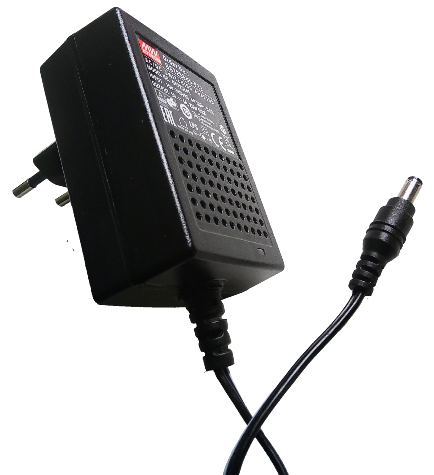
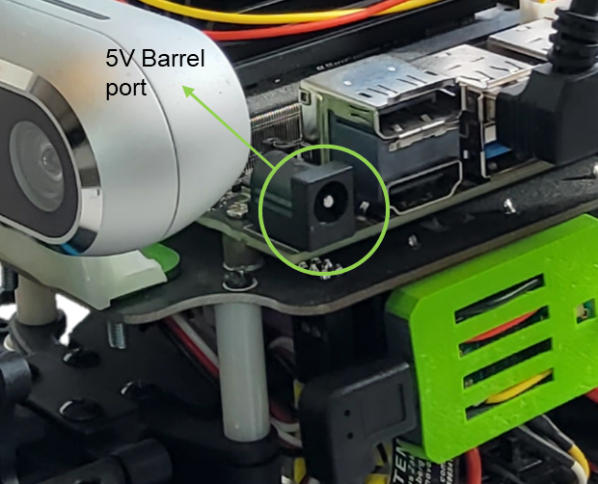
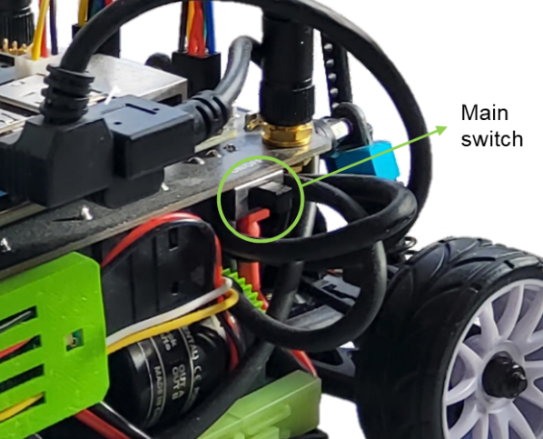
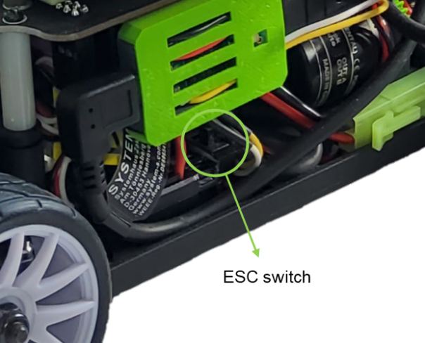
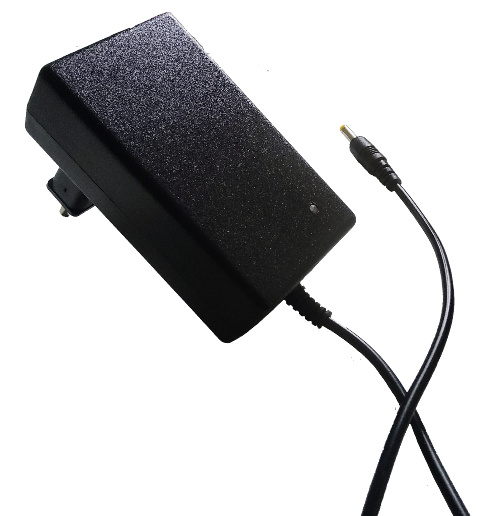
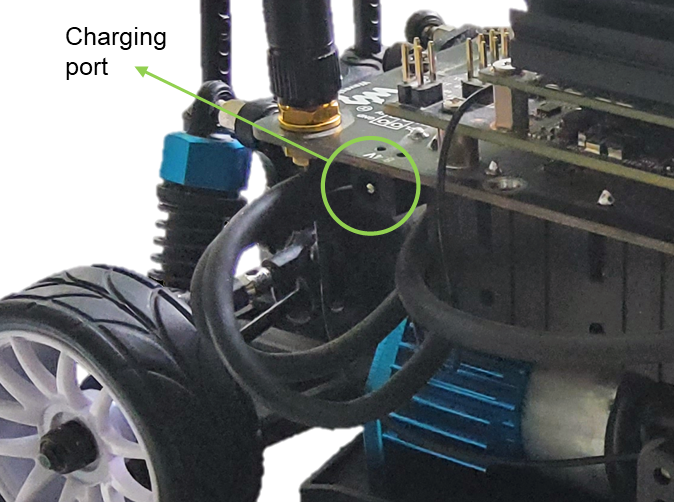
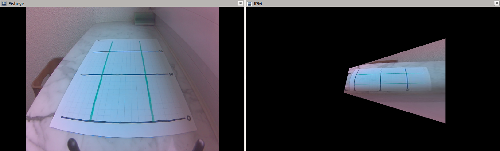

# Visual Lane Following Robot (ACDC Research Project)

**Course Project under ACDC Research Project, ika, RWTH Aachen**  
**Task:** Visual Lane Following for Scaled Automated Vehicles  

---

## Summary
Developed a methodology to visually detect, track, and follow driving lanes with a 1:10 scaled automated vehicle. Implemented ROS nodes on NVIDIA Jetson Nano for real-time lane detection and steering control. Perception models were trained with synthetic data from Gazebo simulations. Integrated perception, localization, and motion-planning modules, with performance evaluation and visualization in Jupyter notebooks.  

**Note:** This is a course project. More details and full data/code can be provided upon request.

---

## Background and Motivation
Scaled-down robotic models of automated and connected vehicles enable research and development for real-size vehicles at low cost. The vehicle is equipped with sensors including stereoscopic cameras and an on-board computing unit. Insights gained from scaled vehicles can be transferred to full-size vehicles.  

---

## Task
- Develop a methodology to visually detect, track, and follow driving lanes.
- Implement ROS nodes to process sensor data and generate steering commands.
- Evaluate performance qualitatively (lane following, curves, lighting conditions) and quantitatively (max speed, lateral/longitudinal acceleration).
- Document methodology and results in a Jupyter notebook report.

---

## Required Tools and Data
- Scaled ACV Platform (access will be granted)
- ROS, OpenCV, Inverse Perspective Mapping
- Live sensor data from the vehicle
- Test track including driving lanes (provided or self-constructed)

**Contact for access and further details.**

---

## Hints / Relevant Sections
- Sensor Data Processing Algorithms
- Camera-based Semantic Grid Mapping
- Vehicle Guidance
- Connected Driving
- Collective Cloud Functions

# Scaled Automated & Connected Vehicle Platform

This repository contains a software platform for running a *Scaled Automated and Connected Vehicle (SACV)*. The platform is stripped down to components required for one of tasks in *[ACDC Research Project SS25](https://git.rwth-aachen.de/ika/acdc-research-project-ss25/acdc-research-project-ss25)*. The software stack is part of a larger SACV platform consisting of scaled vehicles and cloud servers.

The following parts of this README specifically target [*ACDC RP Task 7: Lane Following for Scaled Automated Vehicles*](https://git.rwth-aachen.de/ika/acdc-research-project-ss25/acdc-research-project-ss25/-/blob/main/topics/07-Lane-Following-for-Scaled-Automated-Vehicles/task.ipynb).

- [ika Racer](#ika-racer)
  - [Specifications](#specifications)
  - [Start-up](#start-up)
  - [Charging](#charging)
  - [Initial Setup](#initial-setup)
  - [Software Launch](#software-launch)

## ika Racer

The *ika Racer* as shown below is a modified RC-car mounted with a set of sensors, an embedded computer development kit to process sensor data, and a networking module to exchange data with other connected devices. The vehicle is based on the NVIDIA-backed open-source *JetRacer* platform, including an *NVIDIA Jetson Nano* embedded computing unit.

### Specifications

The specifications of ika Racer, a modified JetRacer, are listed in the table below. The stock platform, JetRacer, brings computation power and I/O, but falls short in terms of sensors for, e.g., depth perception, orientation, and speed measurement. Therefore, the platform has been retrofitted with the *italicized* components.

| Feature | Specifications |
| --- | --- |
| Scale | 1:10 |
| Suspension | independent and adjustable |
| Drive type | Ackermann steering and 4WD front and rear axle differentials |
| Powertrain | brushed DC motor (no encoder) |
| Steering | Servo motor |
| Batteries | 4x 18650-35E Li-ion @ 8.4V, 2A |
| Primary controller | NVIDIA Jetson Nano |
| Memory | 4GB RAM, 64GB ROM |
| Connectivity | Gigabit Ethernet (RJ45), 802.11ac (WiFi 5), Bluetooth 4.2 |
| Camera | 8MP, 160° FoV wide angle |
| *Bridging controller* | Teensy 4.0 |
| *Depth camera* | RealSense D455 (2x IR, 1x RGB, 1x IR projector, 6-axis IMU) |
| *Rotary encoder* | incremental, 200 pulses/revolution, quadrature |

### Start-up

The vehicle can be started in two different ways, on-batteries, and off-batteries.Note that the Jetson Nano can be powered by either the supplied adapter or the on-board batteries, while the actuators/motors are powered only by the batteries.

#### Off-batteries

Running off-batteries is mainly helpful for development, when only the Jetson Nano is booted up and the motors are switched off, since there is no power supply by the batteries. Power the Jetson Nano via the 5V barrel port (fig. 2) using the 5V power brick (fig. 1). If necessary, toggle the switches (fig. 3, 4) to test any functions with the actuators. Make sure to toggle both switches when turning off the device in order to not drain the batteries.

#### On-batteries

Running on-batteries is necessary to test driving functions, when both the Jetson Nano and the actuators are powered by the batteries. Toggle the switches (fig. 3, 4) to start-up both. Make sure to toggle both switches when turning off the device in order to not drain the batteries.

### Charging

In order to charge the Li-ion batteries, plug in the barrel jack of the 8.4V power brick (fig. 1) into the charging port (fig. 2).

### Initial Setup

Follow the steps below to set up a working remote development environment connected to the vehicle computer.

1. Start-up the vehicle off-batteries.
1. Connect a mouse and keyboard via USB (unplug any USB port first, if blocked) and connect an external display via HDMI.
1. Log in to the Ubuntu GUI using below credentials.
    - User: `dev` (*Deviser*)
    - Password: `jetracer`
1. Connect to WiFi.
    - If connecting to *eduroam*, refer to [these instructions](https://help.itc.rwth-aachen.de/en/service/1hroqqbju4g2t/article/53793cf170344431841a900a1b81287c/).
    - Make sure to enable all users to connect to this network in the connection settings, otherwise the connection will drop when you log out.
1. Take note of the computer's IPv4 address, either via system settings or as shown on the vehicle's on-device display.
1. Log out and disconnect mouse, keyboard, and display.
1. Make sure that your personal computer is connected to the same WiFi network.
1. On your personal computer, open *Visual Studio Code*.
1. Use VS Code's Remote Development extension to connect the window to the vehicle computer.
    - If not clear, refer to the instructions given in the ACDC RP meetings.
    - No SSH key is needed, you are authenticating using the username/password credentials.
1. Once connected to the vehicle, open the folder `~/git/acdc-research-project-ss25/topics/07-Lane-Following-for-Scaled-Automated-Vehicles/scaled-acv-device-platform` in VS Code.
    - The ACDC RP repository has already been cloned for you.
    - This repository is included as a Git submodule.
1. Open a new terminal in VS Code and navigate to `~/git/acdc-research-project-ss25/topics/07-Lane-Following-for-Scaled-Automated-Vehicles/scaled-acv-device-platform/ros`.
1. Compile the ROS workspace in release mode by executing `catkin build -j 2 -DCMAKE_BUILD_TYPE=Release`. Note that a fresh build might take 15 minutes or longer.

### Software Launch

Follow the steps below to launch the vehicle driving functions in tele-operation mode (controlled via bluetooth controller), along with *Inverse Perspective Mapping (IPM)* running on the fisheye camera images.

1. Start-up the vehicle on-batteries.
1. Connect VS Code on your personal computer to the vehicle computer.
1. Open a new terminal in VS Code and navigate to `~/git/acdc-research-project-ss25/topics/07-Lane-Following-for-Scaled-Automated-Vehicles/scaled-acv-device-platform/ros`.
1. Compile the ROS workspace in release mode by executing `catkin build -j 2 -DCMAKE_BUILD_TYPE=Release`.
1. Source the ROS workspace by executing `source devel/setup.bash`.
1. Launch the main driving functions of the vehicle, including sensors and actuators, by executing `roslaunch ika_racer bring_up.launch`.
    - The launch file [`bring_up.launch`](ros/src/ika_racer/launch/bring_up.launch) is the main entrypoint, which is including separate launch files for system components (e.g., perception) in a modular fashion. It is recommended to have a look at the launch file stack.
    - By default, the components `perception`, `localization`, `locomotion`, and `teleoperation` are launched. Together, they provide all functionality to drive the sensors and steer the actuators via remote control inputs.
    - ~~Check the terminal output for a `gstreamer` error message. Sometimes the fisheye camera does not start correctly. If that is the case, execute `sudo systemctl restart nvargus-daemon` and try again.~~ At the moment, the fisheye camera driver is broken. You can use the RealSense stereo camera instead.
1. Turn on the bluetooth remote controller (switch on the back) and steer the vehicle.
    - The left control stick (up/down) controls speed. Note that the vehicle is currently not capable of driving backwards due to insufficient torque.
    - The right control stick (left/right) controls steering angle.
1. In a new terminal, source the workspace again and launch the IPM function by executing `roslaunch ika_racer functions.launch`.
    - The launch file [`functions.launch`](ros/src/ika_racer/launch/functions.launch) currently only includes the IPM function.
    - The IPM ROS node is set up to geometrically transform the fisheye camera image to a bird's eye view (BEV) perspective.
    - See the [IPM README](ros/src/functions/inverse_perspective_mapping_cpp/README.md) for more information.
1. In yet another terminal, launch `rviz` for visualization. Display both the fisheye camera image as well as the IPM image by adding the corresponding topics to the visualization.
    - If the Rviz GUI is not opening on your personal computer, refer to [ACDC RP's troubleshooting wiki](https://git.rwth-aachen.de/ika/acdc-research-project-ss25/acdc-research-project-ss25/-/wikis/home#warning-cannot-run-gui-applications-when-connected-to-remote-ika-workstation).
        - Note that the *Remote X11 VS Code extension* proposed in the wiki only works if authenticated via SSH key instead of password. You may set up SSH key access from your personal computer to the vehicle computer.
        - Alternatively, try opening a terminal outside of VS Code and connecting via `ssh -Y dev@<IP>`, and then within that remote connection opening Rviz.
1. In yet another terminal, launch `rqt_reconfigure` by executing `rosrun rqt_reconfigure rqt_reconfigure`. Try to fine-tune the IPM transformation parameters to get an optimal BEV image.
    - The geometric transformation between camera and BEV perspectives is determined by the intrinsic camera parameters and the extrinsic pose of the camera related to some world reference point.
    - The `rqt_reconfigure` interface allows you to dynamically change translation and rotation values in order to find a good transformation.
1. Try to find the topic on which the controller is sending information to the speed and steering controllers. Use `rostopic list` and `rostopic echo` to listen to the messages.

