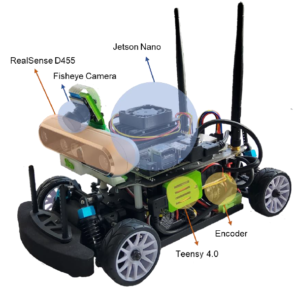

# Visual Lane Following Robot (ACDC Research Project)

**Course Project under ACDC Research Project, ika, RWTH Aachen**  
**Task:** Visual Lane Following for Scaled Automated Vehicles  

---

## Summary
Developed a methodology to visually detect, track, and follow driving lanes with a 1:10 scaled automated vehicle. Implemented ROS nodes on NVIDIA Jetson Nano for real-time lane detection and steering control. Perception models were trained with synthetic data from Gazebo simulations. Integrated perception, localization, and motion-planning modules, with performance evaluation and visualization in Jupyter notebooks.  

**Note:** This is a course project. More details and full data/code can be provided upon request.

---

## Background and Motivation
Scaled-down robotic models of automated and connected vehicles enable research and development for real-size vehicles at low cost. The vehicle is equipped with sensors including stereoscopic cameras and an on-board computing unit. Insights gained from scaled vehicles can be transferred to full-size vehicles.  

---

## Task
- Develop a methodology to visually detect, track, and follow driving lanes.
- Implement ROS nodes to process sensor data and generate steering commands.
- Evaluate performance qualitatively (lane following, curves, lighting conditions) and quantitatively (max speed, lateral/longitudinal acceleration).
- Document methodology and results in a Jupyter notebook report.

---

## Required Tools and Data
- Scaled ACV Platform (access will be granted)
- ROS, OpenCV, Inverse Perspective Mapping
- Live sensor data from the vehicle
- Test track including driving lanes (provided or self-constructed)

**Contact for access and further details.**

---

## Hints / Relevant Sections
- Sensor Data Processing Algorithms
- Camera-based Semantic Grid Mapping
- Vehicle Guidance
- Connected Driving
- Collective Cloud Functions

# Scaled Automated & Connected Vehicle Platform

This repository contains a software platform for running a *Scaled Automated and Connected Vehicle (SACV)*. The platform is stripped down to components required for one of tasks in *[ACDC Research Project SS25](https://git.rwth-aachen.de/ika/acdc-research-project-ss25/acdc-research-project-ss25)*. The software stack is part of a larger SACV platform consisting of scaled vehicles and cloud servers.

The following parts of this README specifically target [*ACDC RP Task 7: Lane Following for Scaled Automated Vehicles*](https://git.rwth-aachen.de/ika/acdc-research-project-ss25/acdc-research-project-ss25/-/blob/main/topics/07-Lane-Following-for-Scaled-Automated-Vehicles/task.ipynb).

- [ika Racer](#ika-racer)
  - [Specifications](#specifications)
  - [Start-up](#start-up)
  - [Charging](#charging)
  - [Initial Setup](#initial-setup)
  - [Software Launch](#software-launch)

## ika Racer

The *ika Racer* as shown below is a modified RC-car mounted with a set of sensors, an embedded computer development kit to process sensor data, and a networking module to exchange data with other connected devices. The vehicle is based on the NVIDIA-backed open-source *JetRacer* platform, including an *NVIDIA Jetson Nano* embedded computing unit.

### Specifications

The specifications of ika Racer, a modified JetRacer, are listed in the table below. The stock platform, JetRacer, brings computation power and I/O, but falls short in terms of sensors for, e.g., depth perception, orientation, and speed measurement. Therefore, the platform has been retrofitted with the *italicized* components.

| Feature | Specifications |
| --- | --- |
| Scale | 1:10 |
| Suspension | independent and adjustable |
| Drive type | Ackermann steering and 4WD front and rear axle differentials |
| Powertrain | brushed DC motor (no encoder) |
| Steering | Servo motor |
| Batteries | 4x 18650-35E Li-ion @ 8.4V, 2A |
| Primary controller | NVIDIA Jetson Nano |
| Memory | 4GB RAM, 64GB ROM |
| Connectivity | Gigabit Ethernet (RJ45), 802.11ac (WiFi 5), Bluetooth 4.2 |
| Camera | 8MP, 160° FoV wide angle |
| *Bridging controller* | Teensy 4.0 |
| *Depth camera* | RealSense D455 (2x IR, 1x RGB, 1x IR projector, 6-axis IMU) |
| *Rotary encoder* | incremental, 200 pulses/revolution, quadrature |

---

